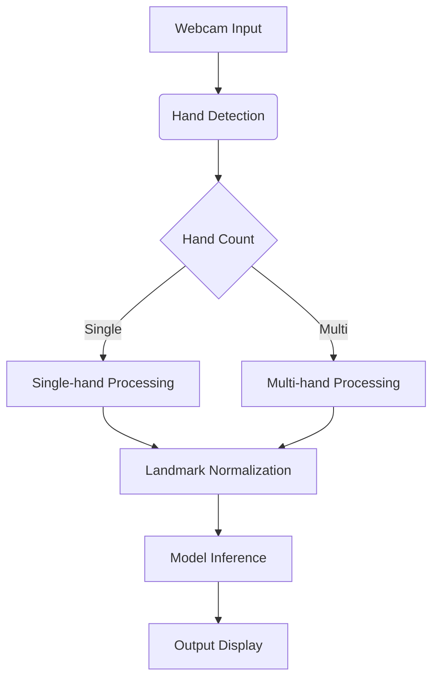

# ASL Recognition System


A modular system for American Sign Language (ASL) recognition using hand landmarks, supporting both single-hand and two-hand signs.

## Table of Contents
- [Features](#features)
- [Installation](#installation)
- [Usage](#usage)
- [Dataset Format](#dataset-format)
- [Model Architecture](#model-architecture)
- [System Design](#system-design)

## Features
- Real-time hand landmark detection using MediaPipe
- Support for both single-hand and two-hand ASL signs
- Modular architecture for easy maintenance and extension
- Cross-platform compatibility (Windows/macOS)
- Comprehensive CLI interface

## Installation

### Prerequisites
Python 3.11 - 3.12
MediaPipe (for hand landmark detection)
pip package manager

- Create virtual environment

```bash
python -m venv asl_env
```
- Activate environment (macOS/Linux)

```bash
source asl_env/bin/activate
```
- Activate environment (Windows)

```bash
source asl_env/Scripts/activate
```

- Install dependencies
```bash
pip install -r requirements.txt
```

## Usage

### Data Collection
Single-hand sign collection

```bash
python asl_app.py collect --letter A --samples 100
```

Two-hand sign collection

```bash
python asl_app.py collect --letter MEET --samples 100 --multi-hand
```

```bash
python asl_app.py collect --letter MEET --samples 100 --multi-hand --output multi_hand_dataset.csv
```

Or collect data for multiple letters interactively:

```bash
python asl_app.py collect
```

### Data Analysis
Analyze the collected dataset:

```bash
python asl_app.py analyze --input asl_landmarks_dataset.csv
```

### Combining Datasets

Combine single-hand and multi-hand datasets:

```bash
python asl_app.py combine --single-hand single_hand_dataset.csv --multi-hand multi_hand_dataset.csv --output combined_dataset.csv
```

### Model Training
Train the ASL recognition model for single-hand signs:

```bash
python asl_app.py train --input asl_landmarks_dataset.csv
```

Train a model specifically for multi-hand signs:

```bash
python asl_app.py train --input multi_hand_dataset.csv --multi-hand
```

Train a unified model that handles both single-hand and two-hand signs:

```bash
python asl_app.py train-unified --single-hand single_hand_dataset.csv --multi-hand multi_hand_dataset.csv
```
### Real-time Recognition
Run real-time ASL recognition using webcam:

```bash
python asl_app.py run
```

For multi-hand sign recognition:

```bash
python asl_app.py run --multi-hand
```

 ### Model Evaluation
Evaluate the model on saved data:

```bash
python asl_app.py evaluate --input test_dataset.csv
```

For multi-hand model evaluation:

```bash
python asl_app.py evaluate --input multi_hand_test_dataset.csv --multi-hand
```

## Dataset Format

### Single-hand Signs
- 21 landmarks × 3 coordinates (x, y, z)
- Normalized relative to wrist position
- CSV columns: `label,landmark_0_x,landmark_0_y,landmark_0_z,...`

### Two-hand Signs
- Hand count indicator (1 or 2)
- Separate landmarks for left and right hands
- CSV columns: `label,hand_count,left_0_x,...,right_0_x,...`

## Model Architecture

### Single-hand Model
```python
InputLayer(63) -> Dense(128, activation='relu') -> Dense(num_classes, activation='softmax')
```

### Multi-hand Model
```python
InputLayer(127) -> Dense(128, activation='relu') -> Dense(64, activation='relu') -> Dense(num_classes, activation='softmax')
```

- **Optimizer**: Adam (learning_rate=0.001)
- **Loss**: Categorical Cross-entropy
- **Metrics**: Accuracy, Precision, Recall

## System Design



Key Components:
- **asl_modules/utils.py**: Shared utilities
- **asl_modules/data_collection.py**: Data pipeline
- **asl_modules/training.py**: Model development
- **asl_modules/inference.py**: Real-time prediction

Thank you for your interest in the ASL Recognition System!

services:
  - type: web
    name: asl-demo
    env: python
    buildCommand: pip install -r requirements.txt
    startCommand: gunicorn --worker-class eventlet -w 1 
    --timeout 120 --keep-alive 65 --log-level debug app:app
    envVars:
      - key: PYTHON_VERSION
        value: 3.11.9
      - key: WEB_CONCURRENCY
        value: 1
    resources:
      memory: 512M


